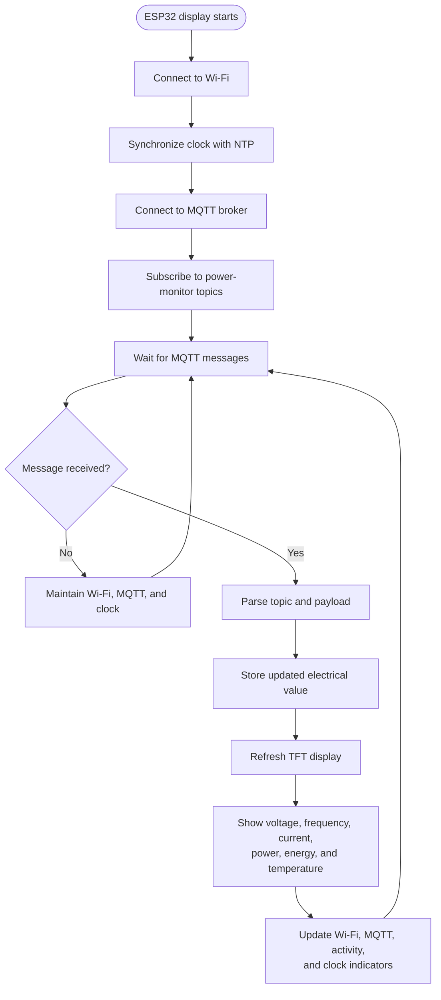

# Lab Power Monitor Flowchart

The repository currently documents the intended behavior in `README.md`; the referenced `power_display_mqtt_tft.ino` source file is not currently present.

```mermaid
flowchart TD
    A(["ESP32 display starts"]) --> B["Connect to Wi-Fi"]
    B --> C["Synchronize clock with NTP"]
    C --> D["Connect to MQTT broker"]
    D --> E["Subscribe to power-monitor topics"]
    E --> F["Wait for MQTT messages"]
    F --> G{"Message received?"}
    G -- "No" --> H["Maintain Wi-Fi, MQTT, and clock"]
    H --> F
    G -- "Yes" --> I["Parse topic and payload"]
    I --> J["Store updated electrical value"]
    J --> K["Refresh TFT display"]
    K --> L["Show voltage, frequency, current,<br/>power, energy, and temperature"]
    L --> M["Update Wi-Fi, MQTT, activity,<br/>and clock indicators"]
    M --> F
```
